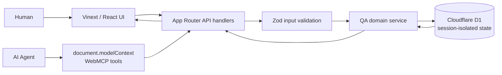

# TestPilot

**Agent-native QA Mission Control for the OpenAI WebMCP Challenge**

TestPilot is a compact release-engineering workspace where a human and an AI agent investigate the same live QA state. The human gets a polished mission-control UI for requirements, test cases, executions, defects, traceability, and release readiness. The agent gets strongly described semantic actions registered directly by the page through WebMCP.

The competition scenario focuses on e-commerce inventory safety in release **2.4**. Known tests initially pass, but a critical concurrent-purchase requirement has no coverage. An agent can discover that gap, create and run the missing test, diagnose the deterministic race condition, create a critical defect, link the evidence, and produce a **NOT READY** recommendation. Every mutation appears in the UI immediately.

## Problem

Traditional browser agents must infer intent from presentation: inspect the DOM, locate a control, click it, wait, and reinterpret the result. That is slow and fragile because layout, labels, loading states, and responsive behavior can change without the underlying business capability changing.

## Solution

[WebMCP](https://github.com/webmachinelearning/webmcp) lets a page expose its capabilities as structured, discoverable tools through `document.modelContext`. TestPilot registers QA actions such as `get_coverage_gaps`, `run_test`, and `create_defect`. Each action has a descriptive purpose, a JSON input schema, validated server-side input, and a predictable JSON response.

The UI and WebMCP tools call the same domain service and persistent state. There is no second “agent-only” data model, so an action performed by the agent becomes visible to the human within the polling interval (and immediately through an in-page refresh event).

## Architecture



### Design choices

- **OpenAI Sites + Vinext + React + strict TypeScript**: a Cloudflare Worker-compatible application that retains the familiar App Router structure.
- **Cloudflare D1 repository**: durable structured state that survives reloads and production restarts.
- **Anonymous session isolation**: every browser receives a secure session cookie and an independent seeded workspace, preventing judges from overwriting one another's demo state.
- **Optimistic concurrency control**: revision-checked D1 updates preserve simultaneous tool actions without silently losing a write.
- **Domain service boundary**: coverage, execution, failure analysis, defect, and readiness logic are independent of the UI and transport.
- **Polling every 1.5 seconds + immediate page event**: reliable cross-client refresh with no WebSocket infrastructure.
- **Deterministic simulation**: TC-001 through TC-003 pass; the agent-created concurrency scenario TC-004 fails with stable structured evidence.

## Prerequisites

- Node.js 22.13 or newer
- npm 10 or newer
- A WebMCP-capable browser for agent discovery: ChatGPT/Codex in-app browser, or a supported Chrome experimental configuration

## Installation

From PowerShell in the repository root:

```powershell
npm install
```

No database setup, environment variables, or seed command is required for local development. The Sites development runtime provisions a local D1 database and TestPilot creates a seeded session on first use.

## Running locally

```powershell
npm run dev
```

Open [http://localhost:3000](http://localhost:3000). For a production build:

```powershell
npm run build
npm start
```

The production build emits a Cloudflare Worker-compatible Sites bundle in `dist/`.

## Demo walkthrough

1. Open TestPilot. The dashboard shows 100% pass rate and zero critical defects, but release 2.4 is **AT RISK** because REQ-003 has no coverage.
2. Ask the AI agent: **“Check whether version 2.4 is safe to release.”**
3. The agent calls `get_release_details`, `get_requirements`, and `get_coverage_gaps`.
4. The returned gap identifies REQ-003 and recommends a two-customer final-item scenario.
5. The agent calls `create_test_case`; TC-004 appears in the Test Cases view with an **AI Agent** badge.
6. The agent calls `run_test({ "test_id": "TC-004" })`; EXE-004 appears as **FAIL**, with inventory `-1` evidence.
7. The agent retrieves and diagnoses EXE-004 with `get_execution_results` and `inspect_failure`.
8. The agent calls `create_defect` with critical severity, then `link_defect_to_test`. DEF-001 appears with full evidence.
9. The agent calls `get_release_readiness`; the dashboard changes to **NOT READY** because negative inventory is possible.
10. Click **Reset Demo** to restore TC-001–TC-003, their passing baseline executions, no defects, and REQ-003 as uncovered.

### Exact agent action sequence

```text
get_release_details({ version: "2.4" })
get_requirements({ version: "2.4" })
get_coverage_gaps({ version: "2.4" })
create_test_case({
  title: "Two customers simultaneously purchase the last remaining item",
  description: "Start with one unit and submit two checkouts concurrently.",
  requirement_id: "REQ-003",
  expected_behavior: "Only one purchase succeeds and inventory never becomes negative."
})
run_test({ test_id: "TC-004" })
get_execution_results({ execution_id: "EXE-004" })
inspect_failure({ execution_id: "EXE-004" })
create_defect({
  title: "Concurrent checkout allows negative inventory",
  description: "Both checkout requests succeed for the final unit, producing inventory -1.",
  severity: "critical",
  execution_id: "EXE-004"
})
link_defect_to_test({ defect_id: "DEF-001", test_id: "TC-004" })
get_release_readiness({ version: "2.4" })
```

## WebMCP tools

| Tool | Purpose | Mutates state |
|---|---|---:|
| `get_releases` | List available releases | No |
| `get_release_details` | Read release metadata and current assessment | No |
| `get_requirements` | Read requirements, priorities, coverage, and links | No |
| `get_test_cases` | Read all tests or filter by requirement | No |
| `get_coverage_gaps` | Find requirements without test coverage | No |
| `create_test_case` | Add a validated requirement-linked test | Yes |
| `run_test` | Run one deterministic test and persist evidence | Yes |
| `run_release_regression` | Run every current test for a release | Yes |
| `get_execution_results` | Retrieve result, duration, and evidence | No |
| `inspect_failure` | Explain root cause, impact, and remediation | No |
| `create_defect` | Open a validated defect with evidence | Yes |
| `link_defect_to_test` | Complete defect-to-test traceability | Yes |
| `get_release_readiness` | Compute READY / AT RISK / NOT READY | No |
| `reset_demo` | Restore the deterministic initial state | Yes |

All tools are registered in [`src/webmcp/use-webmcp.ts`](src/webmcp/use-webmcp.ts) from the catalog in [`src/webmcp/tool-catalog.ts`](src/webmcp/tool-catalog.ts). Calls are handled through `POST /api/tools/{tool_name}` and return:

```json
{
  "success": true,
  "data": {},
  "meta": {
    "tool": "get_release_readiness",
    "state_revision": 7,
    "timestamp": "2026-08-26T19:00:00.000Z"
  }
}
```

Validation and domain errors use the stable form:

```json
{
  "success": false,
  "error": {
    "code": "INVALID_INPUT",
    "message": "Input validation failed for run_test.",
    "details": []
  }
}
```

## Testing and quality checks

Run the automated business-logic suite:

```powershell
npm test
```

Run all static and production checks:

```powershell
npm run lint
npm run typecheck
npm run build
```

When the database schema changes, generate and inspect the migration before building:

```powershell
npm run db:generate
```

The tests cover:

1. Coverage gap detection.
2. Agent test creation and deterministic TC-004 assignment.
3. TC-004 concurrency failure and negative-inventory evidence.
4. Critical defect creation from execution evidence.
5. NOT READY assessment after the critical defect.
6. Exact initial-state restoration through Reset Demo.

## Project structure

```text
app/
  api/                  Next.js state, reset, and semantic tool endpoints
  globals.css           Complete responsive dashboard design system
  layout.tsx            Metadata and fonts
  page.tsx              Application entry point
db/                     D1 schema and runtime binding
drizzle/                Versioned SQLite migrations
public/                  Social preview assets
src/
  components/           Mission Control React UI
  domain/               Types, seed data, repository contract, QA service
  server/               D1 repository, session boundary, and tool dispatcher
  webmcp/               Tool catalog and document.modelContext registration
tests/                  Vitest business-logic suite
.openai/hosting.json     OpenAI Sites project and D1 binding metadata
vite.config.ts           Vinext, Sites, and Cloudflare runtime integration
```

## Prototype limitations

- The e-commerce system and test runner are intentionally simulated; execution behavior is deterministic for a reliable three-minute demo.
- Session state is intentionally anonymous and demo-scoped. Clearing the session cookie creates a fresh isolated TestPilot workspace.
- Browsers without WebMCP show **Preview mode**. The human dashboard and HTTP APIs still work, but agent discovery requires a WebMCP-capable browser.
- Account authentication is intentionally omitted so hackathon judges can test immediately without credentials.

## Hosting

TestPilot is configured for OpenAI Sites with a logical D1 binding named `DB`. Sites owns the production database and applies the checked-in Drizzle migration during deployment. The initial deployment is owner-only; public access should be enabled only after the final hackathon review.

## References

- [OpenAI WebMCP Challenge](https://openai.com/webmcp-challenge/)
- [WebMCP specification and explainer](https://github.com/webmachinelearning/webmcp)
